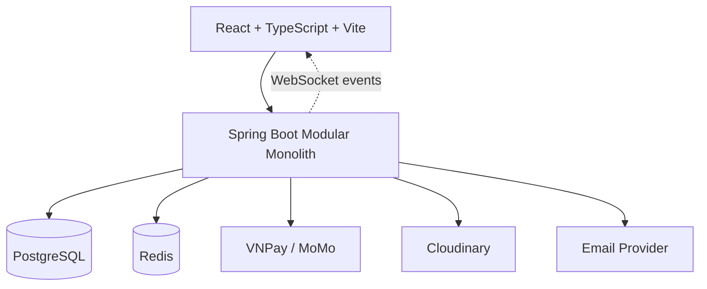
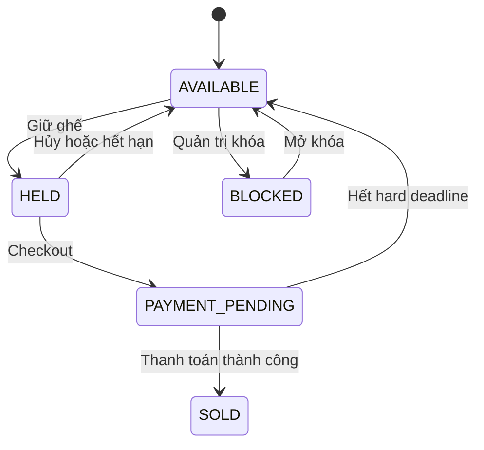
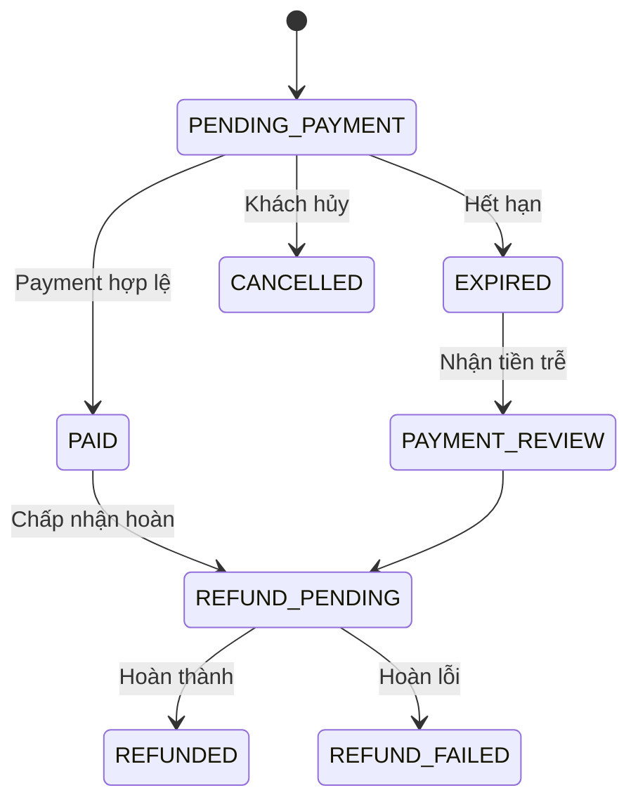
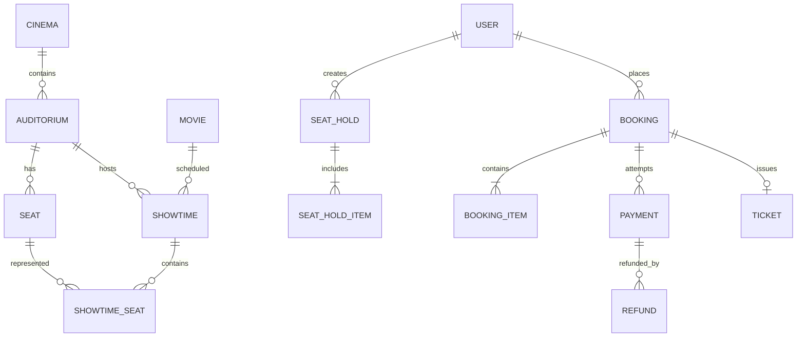

# LAK — System Design & Database Design

> Phiên bản: 1.0  
> Phạm vi: System design, nghiệp vụ, database và API.  
> Không bao gồm UI design.

## 1. Tổng quan

LAK là website đặt vé xem phim cho một thương hiệu có nhiều chi nhánh. Khách hàng có thể tìm phim, chọn suất chiếu, giữ ghế, thanh toán và nhận vé QR. Nhân viên rạp quét vé; quản trị viên quản lý phim, rạp, lịch chiếu, giá vé và doanh thu.

### Mục tiêu cốt lõi

- Không bán trùng ghế trong cùng suất chiếu.
- Giá vé chính xác và được lưu lại tại thời điểm đặt.
- Chỉ phát hành vé sau khi xác nhận thanh toán.
- Tự động giải phóng ghế hết hạn.
- Xử lý được webhook trùng, đến chậm hoặc bị mất.
- Hỗ trợ nhiều chi nhánh nhưng không triển khai multi-brand.

### Ngoài phạm vi MVP

- UI design system.
- Bán bắp nước và merchandise.
- Chương trình thành viên, tích điểm.
- Quét QR ngoại tuyến.
- SMS.
- Nền tảng cho nhiều thương hiệu rạp.

---

## 2. Các quyết định đã chốt

| Nội dung | Phương án |
|---|---|
| Mô hình kinh doanh | Một thương hiệu LAK, nhiều chi nhánh |
| Kiến trúc | Modular Monolith + Layered Architecture |
| Giữ ghế | 5 phút |
| Grace period thanh toán | 2 phút |
| Ngừng bán online | 5 phút trước giờ chiếu |
| Hoàn vé | Trước giờ chiếu tối thiểu 45 phút |
| Ghế đôi | Luôn giữ và bán cả cặp |
| Múi giờ hiển thị | `Asia/Ho_Chi_Minh` |
| Lưu thời gian | UTC |
| Tiền tệ | VND, lưu bằng số nguyên |
| Giao vé | Vé của tôi + email |
| Quét QR | Nhân viên rạp quét online |
| Thanh toán đến trễ | Không phát hành vé; tự động hoàn tiền |
| Nguồn dữ liệu chính | PostgreSQL |
| Vai trò Redis | TTL, cache và hỗ trợ realtime |

---

## 3. Kiến trúc tổng thể



### Nguyên tắc

- PostgreSQL là nguồn dữ liệu quyết định.
- Redis lỗi không được làm sai trạng thái ghế.
- WebSocket chỉ thông báo thay đổi, không quyết định ghế trống.
- Các thay đổi booking, payment và ghế phải chạy trong transaction.
- Module chỉ truy cập dữ liệu của module khác qua service interface hoặc domain event.
- Chưa cần Microservices vì làm tăng độ phức tạp triển khai và transaction phân tán.

---

## 4. Backend modules

| Module | Trách nhiệm |
|---|---|
| Identity | Đăng ký, đăng nhập, JWT, refresh token, quên mật khẩu |
| Authorization | Role và phạm vi chi nhánh |
| Catalog | Phim, thể loại, poster, trailer |
| Cinema | Chi nhánh, phòng chiếu, sơ đồ ghế |
| Showtime | Lịch chiếu, kiểm tra trùng phòng, giá suất chiếu |
| Reservation | Giữ ghế, hết hạn và giải phóng ghế |
| Booking | Tạo đơn, tính tiền, voucher |
| Payment | Giao dịch, webhook, đối soát |
| Refund | Yêu cầu và xử lý hoàn tiền |
| Ticketing | Phát hành vé QR và soát vé |
| Notification | Email và sự kiện thông báo |
| Reporting | Doanh thu, số vé, tỷ lệ lấp đầy |
| Audit | Ghi nhận thao tác quan trọng |

---

## 5. Vai trò và phân quyền

| Vai trò | Quyền chính |
|---|---|
| `CUSTOMER` | Đặt vé, thanh toán, xem vé, yêu cầu hoàn |
| `TICKET_STAFF` | Quét vé tại chi nhánh được phân công |
| `CINEMA_MANAGER` | Quản lý phòng, lịch chiếu, đơn vé của chi nhánh |
| `SUPER_ADMIN` | Quản lý toàn bộ hệ thống |

Nhân viên và quản lý phải được gán phạm vi bằng `staff_cinema_assignments`. Kiểm tra phân quyền phải thực hiện tại backend, không dựa vào việc ẩn chức năng ở frontend.

---

## 6. Luồng nghiệp vụ cốt lõi

### 6.1. Tìm và chọn suất chiếu

1. Khách chọn phim, tỉnh/thành hoặc chi nhánh.
2. Hệ thống trả về các suất còn mở bán.
3. Chỉ hiển thị suất chưa vượt thời điểm đóng bán online.
4. Khách chọn suất và tải sơ đồ ghế.
5. Trạng thái ghế được đọc từ `showtime_seats`.

### 6.2. Giữ ghế

1. Khách gửi danh sách `showtime_seat_id`.
2. Backend mở transaction và khóa các ghế theo thứ tự ID.
3. Thu hồi các hold đã hết hạn.
4. Kiểm tra toàn bộ ghế đang `AVAILABLE`.
5. Nếu có một ghế không hợp lệ, rollback và trả `409 Conflict`.
6. Tạo `seat_hold` hết hạn sau 5 phút.
7. Cập nhật ghế thành `HELD`.
8. Commit transaction.
9. Ghi TTL vào Redis và phát WebSocket event.

Giữ nhiều ghế phải thành công hoặc thất bại toàn bộ.

### 6.3. Checkout và thanh toán

1. Kiểm tra hold thuộc đúng người dùng và chưa hết hạn.
2. Backend tự lấy giá từ `showtime_prices`.
3. Kiểm tra voucher.
4. Snapshot tên ghế, loại ghế và giá vào `booking_items`.
5. Tạo booking `PENDING_PAYMENT`.
6. Tạo payment `INITIATED`.
7. Chuyển ghế sang `PAYMENT_PENDING`.
8. Tạo URL thanh toán.
9. Không reset thời gian giữ ghế khi refresh hoặc tạo lại URL.
10. Chỉ webhook hợp lệ mới được xác nhận thanh toán.

### 6.4. Xác nhận thanh toán

1. Xác minh chữ ký webhook.
2. Kiểm tra `provider_event_id` để chống xử lý lặp.
3. Đối chiếu booking, số tiền và loại tiền.
4. Khóa booking, payment và các ghế liên quan.
5. Nếu còn trong hard deadline:
   - Payment → `SUCCESS`.
   - Booking → `PAID`.
   - Ghế → `SOLD`.
   - Phát hành vé QR.
6. Ghi sự kiện gửi email và WebSocket vào outbox.
7. Commit transaction.

Trang redirect từ cổng thanh toán chỉ dùng để hiển thị kết quả; không phải bằng chứng thanh toán.

### 6.5. Thanh toán đến trễ

- Trong 2 phút grace period: chấp nhận nếu ghế vẫn thuộc booking.
- Sau hard deadline:
  - Không phát hành vé.
  - Booking → `PAYMENT_REVIEW`.
  - Payment vẫn ghi nhận `SUCCESS`.
  - Tạo refund → `REQUESTED`.
  - Ghế được giải phóng khi an toàn.
- Nếu hoàn tiền tự động lỗi, chuyển sang hàng chờ xử lý thủ công.
- Không áp dụng quy tắc “ghế còn trống thì vẫn bán” vì tạo kết quả không nhất quán.

### 6.6. Phát hành và quét vé

1. Mỗi booking đã thanh toán tạo một vé điện tử.
2. Vé chứa QR token ngẫu nhiên, database chỉ lưu hash.
3. Vé xuất hiện trong “Vé của tôi” và được gửi qua email.
4. Nhân viên đăng nhập trang scanner và quét QR.
5. Backend kiểm tra vé, chi nhánh, suất chiếu và trạng thái.
6. Vé hợp lệ được chuyển `USED`.
7. Quét lại trả thông tin lần quét đầu, không cập nhật lần hai.

### 6.7. Hủy và hoàn vé

Khách được yêu cầu hoàn khi:

- Còn ít nhất 45 phút trước giờ chiếu.
- Vé chưa được quét.
- Booking chưa từng hoàn.
- Phương thức thanh toán hỗ trợ hoàn.

Quy tắc:

| Trường hợp | Xử lý |
|---|---|
| Khách hủy đúng hạn | Hoàn 100% |
| Hủy sau hạn | Không hoàn |
| Vé đã quét | Không hoàn |
| Rạp hủy suất | Hoàn 100% không phụ thuộc thời hạn |
| Voucher còn hạn | Khôi phục lượt sử dụng |
| Voucher hết hạn | Không khôi phục |
| Hoàn tiền lỗi | Chuyển xử lý thủ công |

MVP chỉ hỗ trợ hoàn toàn bộ booking, chưa hỗ trợ hoàn từng ghế.

### 6.8. Tạo suất chiếu

1. Quản trị viên chọn phim, phòng và giờ bắt đầu.
2. Tính `end_at` từ thời lượng phim và thời gian dọn phòng.
3. Kiểm tra không giao thời gian với suất khác trong cùng phòng.
4. Tạo showtime.
5. Sao chép ghế của phòng thành `showtime_seats`.
6. Áp dụng bảng giá và tạo `showtime_prices`.
7. Cho phép quản trị viên ghi đè giá riêng cho suất.

---

## 7. Công thức giá

```text
Giá vé đơn vị
= Giá cơ bản
+ Phụ thu định dạng phòng
+ Phụ thu loại ghế
+ Phụ thu ngày hoặc khung giờ
```

```text
Tạm tính = Tổng booking_items.unit_price
Tổng tiền = Tạm tính - Giảm giá voucher + Phí dịch vụ
```

Phí dịch vụ mặc định bằng `0`.

### Thứ tự ưu tiên

1. Giá ghi đè của suất chiếu.
2. Bảng giá của chi nhánh.
3. Bảng giá mặc định toàn hệ thống.

Giá thực tế được tạo vào `showtime_prices`. Khi checkout, giá được snapshot vào `booking_items`; thay đổi bảng giá không ảnh hưởng booking cũ.

---

## 8. Trạng thái nghiệp vụ

### 8.1. Ghế theo suất chiếu



### 8.2. Booking



### 8.3. Ticket

```text
VALID → USED
VALID → CANCELLED
```

---

## 9. Thiết kế database

### 9.1. Quy ước

- Primary key: UUID.
- Tên bảng/cột: `snake_case`.
- Thời gian: `TIMESTAMPTZ`, lưu UTC.
- Tiền VND: `BIGINT`, đơn vị đồng.
- Trạng thái: `VARCHAR` kết hợp `CHECK`.
- Dữ liệu giao dịch không xóa vật lý.
- Mọi bảng chính có `created_at`, `updated_at`.
- Dùng optimistic version cho dữ liệu có cạnh tranh cao.

### 9.2. Identity và phân quyền

| Entity | Trường chính | Ghi chú |
|---|---|---|
| `users` | `id`, `email`, `phone`, `password_hash`, `full_name`, `status` | Email và phone unique khi có giá trị |
| `roles` | `id`, `code`, `name` | Role code unique |
| `user_roles` | `user_id`, `role_id` | Primary key ghép |
| `staff_cinema_assignments` | `user_id`, `cinema_id` | Giới hạn quyền theo chi nhánh |
| `refresh_tokens` | `id`, `user_id`, `token_hash`, `expires_at`, `revoked_at` | Không lưu token thô |
| `password_reset_tokens` | `id`, `user_id`, `token_hash`, `expires_at`, `used_at` | Token dùng một lần |

### 9.3. Phim và rạp

| Entity | Trường chính | Ràng buộc |
|---|---|---|
| `movies` | `id`, `title`, `description`, `duration_minutes`, `age_rating`, `release_date`, `poster_url`, `trailer_url`, `status` | `duration_minutes > 0` |
| `genres` | `id`, `name`, `slug` | Unique `name`, `slug` |
| `movie_genres` | `movie_id`, `genre_id` | Primary key ghép |
| `cinemas` | `id`, `name`, `address`, `city`, `timezone`, `status` | Timezone mặc định `Asia/Ho_Chi_Minh` |
| `auditoriums` | `id`, `cinema_id`, `name`, `screen_format`, `cleanup_minutes`, `status` | Unique `(cinema_id, name)` |
| `seats` | `id`, `auditorium_id`, `row_label`, `seat_number`, `seat_type`, `pair_key`, `status` | Unique vị trí trong phòng |

### 9.4. Suất chiếu và giá

| Entity | Trường chính | Ràng buộc |
|---|---|---|
| `showtimes` | `id`, `movie_id`, `auditorium_id`, `start_at`, `end_at`, `sales_close_at`, `status` | Không trùng lịch phòng |
| `price_profiles` | `id`, `cinema_id`, `name`, `effective_from`, `effective_to`, `status` | Một chi nhánh có nhiều phiên bản giá |
| `price_rules` | `id`, `profile_id`, `day_type`, `time_from`, `time_to`, `screen_format`, `seat_type`, `amount`, `priority` | Rule có thời hạn |
| `showtime_prices` | `id`, `showtime_id`, `seat_type`, `price`, `source` | Unique `(showtime_id, seat_type)` |
| `showtime_seats` | `id`, `showtime_id`, `seat_id`, `status`, `current_hold_id`, `current_booking_id`, `hold_expires_at`, `version` | Unique `(showtime_id, seat_id)` |

### 9.5. Giữ ghế và booking

| Entity | Trường chính | Ràng buộc |
|---|---|---|
| `seat_holds` | `id`, `user_id`, `showtime_id`, `hold_token`, `status`, `expires_at`, `hard_expires_at` | Token unique |
| `seat_hold_items` | `hold_id`, `showtime_seat_id` | Unique ghế trong hold |
| `bookings` | `id`, `booking_code`, `user_id`, `showtime_id`, `hold_id`, `voucher_id`, `subtotal`, `discount_amount`, `service_fee`, `total_amount`, `status`, `payment_deadline`, `hard_deadline` | Booking code unique |
| `booking_items` | `id`, `booking_id`, `showtime_seat_id`, `seat_label_snapshot`, `seat_type_snapshot`, `unit_price` | Snapshot không thay đổi |

### 9.6. Thanh toán và hoàn tiền

| Entity | Trường chính | Ràng buộc |
|---|---|---|
| `payments` | `id`, `booking_id`, `provider`, `provider_transaction_id`, `provider_event_id`, `amount`, `currency`, `status`, `paid_at`, `expires_at` | Transaction và event ID unique |
| `payment_events` | `id`, `payment_id`, `provider_event_id`, `event_type`, `payload_hash`, `received_at` | Chống xử lý webhook lặp |
| `refunds` | `id`, `booking_id`, `payment_id`, `amount`, `reason`, `status`, `provider_refund_id`, `requested_at`, `refunded_at` | Một refund đang hoạt động cho mỗi booking |

### 9.7. Voucher

| Entity | Trường chính | Ràng buộc |
|---|---|---|
| `vouchers` | `id`, `code`, `discount_type`, `discount_value`, `min_order_amount`, `max_discount_amount`, `starts_at`, `ends_at`, `usage_limit`, `usage_count`, `per_user_limit`, `status` | Code unique; quota không âm và không vượt `usage_limit` |
| `voucher_redemptions` | `id`, `voucher_id`, `user_id`, `booking_id`, `discount_amount`, `redeemed_at` | Một redemption cho mỗi booking |

### 9.8. Vé và vận hành

| Entity | Trường chính | Ràng buộc |
|---|---|---|
| `tickets` | `id`, `booking_id`, `ticket_code`, `qr_token_hash`, `status`, `issued_at`, `used_at` | Một ticket cho mỗi booking |
| `ticket_scan_logs` | `id`, `ticket_id`, `scanner_user_id`, `cinema_id`, `result`, `scanned_at` | Chỉ một lần scan thành công |
| `outbox_events` | `id`, `event_type`, `aggregate_id`, `payload`, `status`, `retry_count` | Gửi email/event đáng tin cậy |
| `audit_logs` | `id`, `actor_id`, `action`, `entity_type`, `entity_id`, `metadata`, `created_at` | Không cập nhật sau khi ghi |

### 9.9. Quan hệ chính



---

## 10. Constraint và index quan trọng

### Constraint

- Unique `showtime_seats(showtime_id, seat_id)`.
- Unique `bookings(booking_code)`.
- Unique `payments(provider, provider_transaction_id)`.
- Unique `payment_events(provider_event_id)`.
- Unique `tickets(ticket_code)` và `tickets(qr_token_hash)`.
- Unique `vouchers(code)`.
- Một booking chỉ có tối đa một payment `SUCCESS`.
- Một booking chỉ có tối đa một ticket.
- Ghế đôi phải có đúng hai ghế cùng `pair_key`.
- PostgreSQL exclusion constraint ngăn suất chiếu giao nhau trong cùng phòng.

### Index

- `movies(status, release_date)`.
- `showtimes(movie_id, start_at)`.
- `showtimes(auditorium_id, start_at)`.
- `showtime_seats(showtime_id, status)`.
- `showtime_seats(hold_expires_at)` cho job giải phóng ghế.
- `bookings(user_id, created_at DESC)`.
- `bookings(showtime_id, status)`.
- `payments(booking_id, status)`.
- `refunds(status, requested_at)`.
- `tickets(qr_token_hash)`.
- `outbox_events(status, created_at)`.

---

## 11. API chính

### Authentication

| Method | Endpoint |
|---|---|
| `POST` | `/api/auth/register` |
| `POST` | `/api/auth/login` |
| `POST` | `/api/auth/refresh` |
| `POST` | `/api/auth/logout` |
| `POST` | `/api/auth/forgot-password` |
| `POST` | `/api/auth/reset-password` |

### Catalog và showtime

| Method | Endpoint |
|---|---|
| `GET` | `/api/movies` |
| `GET` | `/api/movies/{id}` |
| `GET` | `/api/genres` |
| `GET` | `/api/cinemas` |
| `GET` | `/api/showtimes/availability` |
| `GET` | `/api/showtimes` |
| `GET` | `/api/showtimes/{id}/seats` |

`GET /api/showtimes/availability` requires `movieId` and returns only cinemas and Vietnam-local
dates that still have a `SCHEDULED` showtime open for sale. The quick-booking UI uses this response
to avoid presenting cinema/date combinations that cannot be purchased.

`GET /api/showtimes` requires `movieId` and ISO `date` (`YYYY-MM-DD`), accepts optional
`cinemaId`, and returns only `SCHEDULED` showtimes whose `sales_close_at` is later than the
server time. All timestamps are UTC ISO-8601 instants. `GET /api/showtimes/{id}/seats` follows
the same sales-open rule and reads the seat snapshot from PostgreSQL.

`POST /api/admin/price-profiles`, `POST /api/admin/price-profiles/{id}/rules`, and
`POST /api/admin/showtimes` enforce role and cinema scope at the backend. Global price profiles
require `SUPER_ADMIN`; cinema-scoped profiles and showtimes require access to their cinema.
Showtime creation snapshots prices using `showtime override -> cinema profile -> system profile`
and snapshots the active auditorium seat layout.

Admin showtime reads are scoped by `cinemaId` and date. Cancellation is an idempotent soft status
transition with an audit record. It immediately closes the showtime to new holds and checkout, then
an outbox workflow releases active holds, expires payment-pending bookings, and requests exactly one
full refund for every paid booking. The workflow cancels valid tickets, restores only vouchers still
within their validity window, and preserves provider failures as `REFUND_FAILED` for manual review.
The API never deletes a showtime or changes its snapped prices/seats.

### Booking

| Method | Endpoint |
|---|---|
| `POST` | `/api/seat-holds` |
| `GET` | `/api/seat-holds/{id}` |
| `DELETE` | `/api/seat-holds/{id}` |
| `POST` | `/api/bookings/checkout` |
| `GET` | `/api/bookings/{code}` |
| `GET` | `/api/me/bookings` |

### Payment và refund

| Method | Endpoint |
|---|---|
| `POST` | `/api/payments` |
| `POST` | `/api/payments/{provider}/webhook` |
| `GET` | `/api/payments/{id}/status` |
| `POST` | `/api/bookings/{id}/refunds` |
| `GET` | `/api/refunds/{id}` |

### Ticket

| Method | Endpoint |
|---|---|
| `GET` | `/api/tickets/{code}` |
| `POST` | `/api/tickets/validate` |
| `POST` | `/api/tickets/{id}/resend-email` |

- `GET /api/me/bookings` returns only the authenticated account's booking and ticket history; its response never contains a QR payload.
- `GET /api/tickets/{code}` is available to the booking owner, a `TICKET_STAFF` or `CINEMA_MANAGER` assigned to that cinema, and `SUPER_ADMIN`. A denial is audited. Only the booking owner receives `qrPayload`; staff and administrators do not.
- The QR payload is deterministically derived from the ticket code with a server signing secret and only its hash is stored. The client renders it only in component memory and must not use local storage, session storage, or a cache.
- Issuing a ticket appends a `notification.email.requested` event in the same transaction. The ticket email contains ticket and showtime details but never the raw QR payload. `POST /api/tickets/{id}/resend-email` is owner-only and rate-limited per owner and ticket.
- `POST /api/tickets/validate` accepts a QR payload or ticket code for `TICKET_STAFF` (or `SUPER_ADMIN`). The backend locks the ticket, enforces cinema scope and the active showtime window, and writes one successful `ticket_scan_logs` row. A replay returns `USED` with the first scan timestamp without changing the ticket or log.

### Admin

- CRUD phim, thể loại và media.
- CRUD chi nhánh, phòng và ghế.
- Catalog write APIs nằm dưới `/api/admin/movies`, `/api/admin/genres`; chỉ `SUPER_ADMIN` được phép thay đổi catalog hoặc xin chữ ký `POST /api/admin/media/signatures` cho Cloudinary. Backend chỉ ký JPEG/PNG/WebP không quá 5 MiB (cấu hình được), không trả API secret.
- Cinema write APIs nằm dưới `/api/admin/cinemas` và `/api/admin/auditoriums`; manager chỉ thao tác chi nhánh được gán. Layout ghế bị từ chối khi phòng đã có suất chiếu để không phá snapshot giao dịch.
- `GET /api/admin/cinemas/{id}` và `GET /api/staff/cinemas/{id}` chỉ cho người có role phù hợp, cùng `SUPER_ADMIN` hoặc nhân sự được gán chi nhánh; mọi thao tác staff/manager theo chi nhánh phải áp cùng cinema scope tại backend.
- CRUD suất chiếu và bảng giá.
- Quản lý booking, payment, refund và voucher.
- Quản lý người dùng và nhân viên.
- Báo cáo doanh thu, vé bán và tỷ lệ lấp đầy.

`GET /api/admin/bookings`, `GET /api/admin/payments`, `GET /api/admin/refunds` và
`GET /api/admin/reports/summary` là read model, luôn kiểm tra cinema scope tại backend và không
có API sửa trực tiếp snapshot booking/payment. `POST /api/admin/refunds/{id}/retry` chỉ re-queue
`REFUND_FAILED` và ghi audit. Quản lý user là `SUPER_ADMIN` only; khóa user thu hồi session đang
hoạt động và cả khóa/mở khóa đều được audit. Báo cáo dùng `Asia/Ho_Chi_Minh`; doanh thu là net sau
refund hoàn tất, còn ticket/occupancy chỉ tính vé valid/used và ghế SOLD.

### Mã lỗi quan trọng

| HTTP | Ý nghĩa |
|---|---|
| `401` | Chưa xác thực |
| `403` | Không có quyền hoặc sai chi nhánh |
| `409` | Ghế vừa được người khác giữ |
| `410` | Hold hoặc booking đã hết hạn |
| `422` | Voucher hoặc dữ liệu nghiệp vụ không hợp lệ |
| `429` | Vượt giới hạn request |

API giữ ghế, checkout, refund và webhook phải hỗ trợ idempotency.

`POST /api/payments` yêu cầu access token `CUSTOMER`, body `bookingCode`, `provider`. Backend kiểm tra chủ booking,
số tiền VND và hard deadline rồi tạo/replay payment `INITIATED`; URL thanh toán do provider adapter trả về. Webhook công khai
chỉ chấp nhận raw payload có chữ ký hợp lệ; redirect URL không được xác nhận thanh toán.

`GET /api/payments/{id}/status` chỉ cho chủ payment và trả cả `status` của payment lẫn `bookingStatus`. Client chỉ poll
endpoint này sau redirect; chỉ cặp `SUCCESS`/`PAID` mới là thanh toán thành công. `PAYMENT_REVIEW` hoặc `REFUND_PENDING`
không được hiển thị là thành công, kể cả khi payment đã có `SUCCESS`.

Payment xác minh sau hard deadline tạo outbox event idempotent `refund.late_payment_requested`. Refund worker khóa payment,
booking và `refunds.payment_id`, tạo đúng một refund `REQUESTED`, giữ booking ở `REFUND_PENDING`, rồi gọi provider bằng
refund ID ổn định. Timeout được retry; lỗi không retry được chuyển `REFUND_FAILED` để xử lý thủ công. Không phát hành vé
trong toàn bộ nhánh thanh toán đến trễ.

`POST /api/seat-holds` yêu cầu access token của `CUSTOMER`, header `Idempotency-Key` và body
`showtimeId`, `showtimeSeatIds`. Response trả ID hold, danh sách snapshot seat ID,
`expiresAt`, `hardExpiresAt` và `serverNow`; client dùng deadline server để đếm ngược. Reuse
cùng key với payload khác bị từ chối; reuse cùng payload replay resource đã tạo, không giữ ghế
lần hai. `GET`/`DELETE` chỉ cho chủ hold; hold hết hạn trả `410` sau khi PostgreSQL giải phóng ghế.

`POST /api/bookings/checkout` yêu cầu access token `CUSTOMER`, header `Idempotency-Key` và body
`holdId` và tùy chọn `voucherCode`. Backend khóa hold/ghế, snapshot giá từ `showtime_prices` vào
`booking_items`, khóa voucher theo code để kiểm tra thời hạn, min order, quota tổng/quota theo user rồi ghi
`voucher_redemptions`; tất cả cùng transaction với booking. Discount và voucher code được snapshot vào booking,
tạo booking `PENDING_PAYMENT` và chuyển ghế sang `PAYMENT_PENDING`; checkout không gia hạn hold. Response trả
booking code, voucher, các khoản tiền, item snapshot, `paymentDeadline`, `hardDeadline` và `serverNow`. Reuse key
với cùng hold và voucher replay booking; reuse key với payload khác bị từ chối. `GET
/api/bookings/{code}` chỉ cho chủ booking.

`POST /api/bookings/{id}/refunds` yêu cầu access token `CUSTOMER` và header `Idempotency-Key`.
API chỉ hoàn toàn bộ booking khi booking thuộc tài khoản, đã thanh toán, vé chưa dùng và thời điểm
hiện tại còn ít nhất 45 phút trước giờ chiếu. Backend khóa payment → booking → ticket → ghế, hủy
ticket, giải phóng ghế, khôi phục voucher còn hạn và tạo/replay một refund 100%.
`GET /api/refunds/{id}` chỉ trả refund thuộc tài khoản đã xác thực; `REFUND_FAILED` là trạng thái
xử lý thủ công, không tạo refund mới.

---

## 12. Redis, WebSocket và background jobs

### Redis

- Lưu TTL hỗ trợ cho seat hold.
- Cache danh sách phim và suất chiếu.
- Rate limit.
- Không lưu dữ liệu thanh toán làm nguồn chính.

Key đề xuất:

```text
hold:{showtimeId}:{showtimeSeatId} = holdId
rate-limit:{userId}:{action}
```

### WebSocket events

- `SEATS_UPDATED`
- `HOLD_EXPIRED`
- `BOOKING_PAID`
- `SHOWTIME_CANCELLED`

Event chỉ chứa ID và trạng thái cần thiết, không chứa thông tin cá nhân.

### Background jobs

- Giải phóng hold hết hạn mỗi 15–30 giây.
- Đối soát payment `PENDING`.
- Retry refund lỗi.
- Gửi email từ outbox.
- Retry outbox event.
- Đóng bán suất chiếu.
- Tổng hợp báo cáo định kỳ.

---

## 13. Bảo mật

- Password dùng BCrypt hoặc Argon2.
- Access token sống ngắn; refresh token được hash và có thể thu hồi.
- Refresh token nên lưu trong cookie `HttpOnly`, `Secure`, `SameSite`.
- Kiểm tra role và cinema scope tại backend.
- Xác minh chữ ký, số tiền và currency của webhook.
- Không nhận giá vé từ frontend.
- QR sử dụng token ngẫu nhiên đủ mạnh; chỉ lưu hash.
- Giới hạn login, giữ ghế, voucher, webhook và quét QR.
- Không ghi token, password hoặc payload nhạy cảm vào log.
- Upload Cloudinary phải được backend ký và kiểm tra loại file/kích thước; preset Cloudinary production cũng phải hạn chế cùng loại file và kích thước.
- Secret lưu trong environment variables.
- Audit các thao tác đổi giá, hủy suất và hoàn tiền.

---

## 14. Độ tin cậy và vận hành

- Transaction bao quanh các thay đổi booking, payment và ghế.
- Outbox pattern bảo đảm email/event không mất sau khi commit.
- Log có `request_id`, `booking_code`, `payment_id`.
- Theo dõi:
  - Số hold đang hoạt động.
  - Tỷ lệ hold hết hạn.
  - Tỷ lệ thanh toán thành công.
  - Webhook lỗi hoặc đến trễ.
  - Refund thất bại.
  - Email retry.
- Sao lưu PostgreSQL định kỳ.
- Health check cho backend, PostgreSQL, Redis và payment adapter.
- Docker hóa frontend, backend, PostgreSQL và Redis.
- Không tự động phát hành vé khi trạng thái thanh toán chưa chắc chắn.

---

## 15. Lộ trình phát triển

### Giai đoạn 1 — Core MVP

- Authentication và phân quyền.
- Phim, rạp, phòng, ghế và suất chiếu.
- Bảng giá.
- Giữ ghế an toàn.
- Booking và thanh toán sandbox.
- Vé QR.
- Email xác nhận.
- Nhân viên quét vé.
- Dashboard và báo cáo cơ bản.

### Giai đoạn 2 — Hoàn thiện vận hành

- Refund API đầy đủ.
- Đối soát payment tự động.
- Voucher nâng cao.
- Audit log.
- Phân quyền quản lý theo chi nhánh.
- Cảnh báo lỗi và monitoring.

### Giai đoạn 3 — Mở rộng

- Thành viên và tích điểm.
- Bán combo bắp nước.
- SMS.
- Giá học sinh, sinh viên và trẻ em.
- Chuyển nhượng vé.
- Quét vé ngoại tuyến có đồng bộ.
- Chỉ xem xét multi-brand khi LAK trở thành nền tảng cho nhiều đơn vị rạp.
